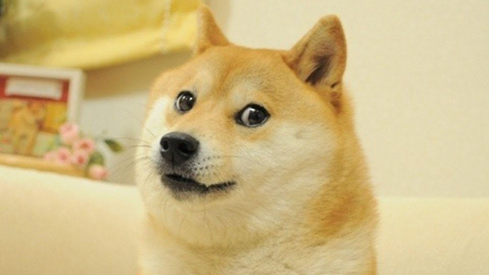

# doge-a-chat
This is a slack command chat bot written in python that takes an image URL  and dogifies it using Cloud Function , Cloud Pub/SUB, and Cloud vision. All images are dsaved in cloud storage.

this is not an official Google product.
for example, the app takes the image:

how it works
to kick off the process, a user enter the /doge command followed by the image url they want to dogify in a slack channel
The functionality of this app is broken down into two Cloud Function.

Doge-queue

triggered by HTTP request from the slackbot 
upon verifying the slack request, the function sends a message to Pb/Sub that contains the request data. The function returns a message back ti the slack channel in the meantime.

doge-response

Triggered when a message is published to specified Pub/Sub topic

after doge-queue publisghes its message to the Pub/Sub topic, doge-response opens the message to get the image URL. The image is run through Cloud Vision to get the labels associated with the image.
Pillow dogefiess the image using the labels as overlay text.

The image is uploaded to the slack channel as a message.
